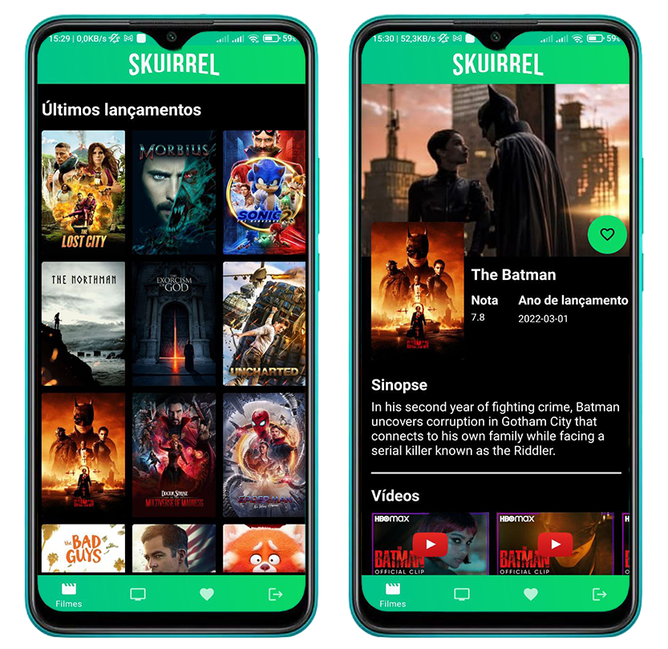

# Skuirrel

<p align="center">
    
</p>

## What is it?

> Skuirrel is an Android app developed for studies based on [TheMovieDB](https://www.themoviedb.org/?language=en) API.
---

## Content

> List of all README contents

- [Skuirrel](#Skuirrel)
- [Setup](#setup)
- [Technologies](#technologies)
- [License](#license)

---

## Setup

- All the necessary `code` to begin

### Build Instructions

1. Clone the repository to your local machine using HTTPS:

```shell
  git clone https://github.com/Ridenn/Skuirrel-App.git
  ```

2. Or use SSH to clone:

```shell
  git clone git@github.com:Ridenn/Skuirrel-App.git
  ```

3. Import the project to Android Studio **or** build it using the command line:

> Mac/Linux
```shell
  ./gradlew clean app:assembleDebug
  ```

> Windows
```shell
  gradlew clean app:assembleDebug
  ```

## Technologies

- Kotlin
- Hilt
- Retrofit
- Picasso
- Firebase (Authentication)
- Moshi

## License

- Copyright 2022 © <a href="https://github.com/Ridenn" target="_blank">Lucas Pedrosa Ribeiro</a>.
